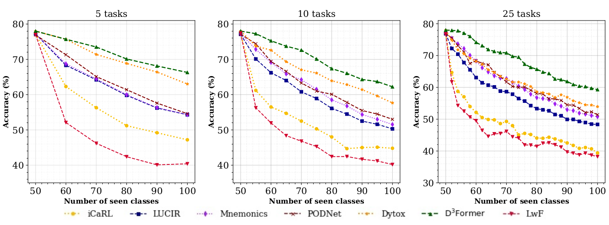
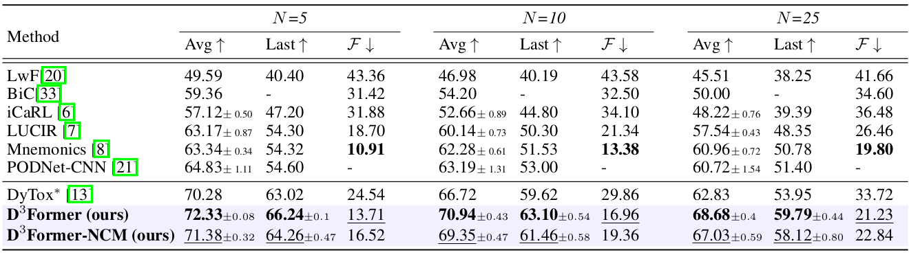
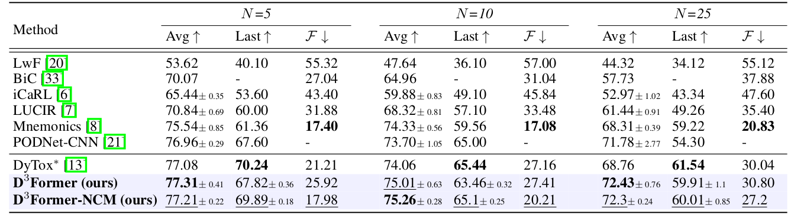

## D^3Former: Debiased Dual Distilled Transformer for Incremental Learning


> *<div style="text-align: justify"> **Abstract:** In class incremental learning (CIL) setting, groups of classes are introduced to a model in each learning phase. The goal is to learn a unified model performant on all the classes observed so far. Given the recent popularity of Vision Transformers (ViTs) in conventional classification settings, an interesting question is to study their continual learning behaviour. In this work, we develop a Debiased Dual Distilled Transformer for CIL dubbed D^3Former. The proposed model leverages a hybrid nested ViT design to ensure data efficiency and scalability to small as well as large datasets. In contrast to a recent ViT based CIL approach, our D^3Former does not dynamically expand its architecture when new tasks are learned and remains suitable for a large number of incremental tasks. The improved CIL behaviour of D^3Former owes to two fundamental changes to the ViT design. First, we treat the incremental learning as a long-tail classification problem where the majority samples from new classes vastly outnumber the limited exemplars available for old classes. To avoid the bias against the minority old classes, we propose to dynamically adjust logits to emphasize on retaining the representations relevant to old tasks. Second, we propose to preserve the configuration of spatial attention maps as the learning progresses across tasks. This helps in reducing catastrophic forgetting by constraining the model to retain the attention on the most discriminative regions. D^3Former obtains favorable results on incremental versions of CIFAR-100, MNIST, SVHN, and ImageNet datasets. </div>*

## Getting Started

We advise using python 3.8, CUDA 11.3 and pytorch version 1.10.1

You may download Anaconda and read the installation instruction on their official website:
<https://www.anaconda.com/download/>

Create a new environment from the provided yml file:

```bash
conda env create -f incremental.yml
conda activate D3former
```


## Datasets

<strong>CIFAR100</strong> will be downloaded automatically by torchvision when running the experiments.

<strong>ImageNet-subset100</strong> can be downloaded by following the instructions [here](https://github.com/yaoyao-liu/class-incremental-learning/tree/main/adaptive-aggregation-networks#imagenet-subset)

<strong>ImageNet1K</strong> can be downloaded from the [official website](https://www.image-net.org/download.php)

The corresponding path of the folder has to be set as `data_dir` argument in [main.py](main.py)

## Results



<strong> D^3Former performance on small scale datasets: </strong> Plots showing task wise accuracy for
different number of incremental tasks for CIFAR-100. D^3Former achieves relatively high accuracy
compared to other state-of-the-art methods when adding 10, 5 and 2 classes per task.


Results of <strong>CIFAR-100</strong> with Average accuracy (%), last phase accuracy (%) and forgetting
rate F(%) of different methods in 5,10 and 25 tasks settings.


Results of <strong>ImageNet100</strong> with Average accuracy (%), last phase accuracy (%) and forgetting
rate F(%) of different methods in 5,10 and 25 tasks settings.

## Running Experiments

<strong> For CIFAR-100</strong>

```bash
python3 main.py --gpu 0 --dataset cifar100 --nb_cl_fg 50 --nb_cl 10 --the_lambda 10 --tau 1 --gamma 0.1 --warmup 10
```
```bash
python3 main.py --gpu 0 --dataset cifar100 --nb_cl_fg 50 --nb_cl 5 --the_lambda 10 --tau 1 --gamma 0.1 --warmup 10
```
```bash
python3 main.py --gpu 0 --dataset cifar100 --nb_cl_fg 50 --nb_cl 2 --the_lambda 10 --tau 1 --gamma 0.1 --warmup 10
```


<strong>ImageNet subset-100</strong>

```bash
python3 main.py --gpu 0 --dataset imagenet_sub --nb_cl_fg 50 --nb_cl 10 --the_lambda 4 --tau 0.3 --gamma 0.05 --warmup 20
```
```bash
python3 main.py --gpu 0 --dataset imagenet_sub --nb_cl_fg 50 --nb_cl 5 --the_lambda 4 --tau 0.3 --gamma 0.05 --warmup 20
```
```bash
python3 main.py --gpu 0 --dataset imagenet_sub --nb_cl_fg 50 --nb_cl 2 --the_lambda 4 --tau 0.3 --gamma 0.05 --warmup 20
```


<strong>ImageNet-1K</strong>

```bash
python3 main.py --gpu 0 --dataset imagenet --nb_cl_fg 500 --nb_cl 100 --the_lambda 4 --tau 0.3 --gamma 0.05 --warmup 20
```
```bash
python3 main.py --gpu 0 --dataset imagenet --nb_cl_fg 500 --nb_cl 50 --the_lambda 4 --tau 0.3 --gamma 0.05 --warmup 20
```

## Acknowledgement

Our code is built upon [AANet](https://github.com/yaoyao-liu/class-incremental-learning/tree/main/adaptive-aggregation-networks). We would like to thank the authors for their implementation.

## Citation

```bibtex
  @article{mohamed2022textrm,
  title={Debiased Dual Distilled Transformer for Incremental Learning},
  author={Mohamed, Abdelrahman and Grandhe, Rushali and Joseph, KJ and Khan, Salman and Khan, Fahad},
  journal={arXiv preprint arXiv:2208.00777},
  year={2022}
}
```

## Contact
Please feel free to create an issue here or contact us at abdelrahman.mohamed@mbzuai.ac.ae, rushali.grandhe@mbzuai.ac.ae
